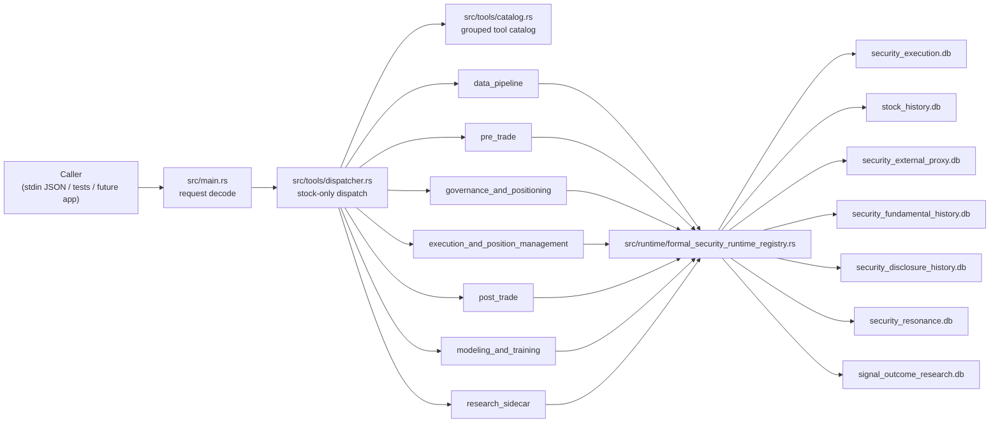

# StockMind

StockMind is the standalone stock-domain snapshot extracted from `TradingAgents`.

This repo keeps the current securities research, governance, execution, post-trade, and modeling chain buildable as an independent Rust project, while intentionally leaving the old foundation stack, GUI shell, and license product shell behind.

## What this repo is for

- Run the stock-only CLI tool surface from one standalone repo
- Preserve the current formal securities mainline as a buildable Rust project
- Keep stock boundaries, grouped business flow, and runtime ownership explicit
- Support further stock-domain work without dragging the old foundation modules back in

## System shape



## Included surface

- Formal stock boundary under `src/ops/stock.rs`
- Grouped gateway shells and scenario-entry shells
- Stock-only dispatcher and public tool catalog
- Governed runtime stores and SQLite repositories
- Stock/security integration tests and source-guard boundary tests

## Intentionally excluded

- Foundation knowledge, workbook, metadata, and generic analytics chain
- GUI shell
- Original license gate
- Old product-level non-stock wrapper layers

## Formal business flow

The public stock catalog is intentionally grouped in this order:

1. `data_pipeline`
2. `pre_trade`
3. `governance_and_positioning`
4. `execution_and_position_management`
5. `post_trade`
6. `modeling_and_training`
7. `research_sidecar`

This ordering is enforced by source-guard tests instead of relying on team memory.

## Repository layout

```text
src/
  main.rs                      CLI entry
  tools/
    catalog.rs                 public stock tool list
    dispatcher.rs              stock-only request dispatch
    dispatcher/stock_ops.rs    tool handlers
  ops/
    mod.rs                     exposes only crate::ops::stock
    stock.rs                   frozen formal stock boundary
    stock_*.rs                 grouped gateways + scenario-entry shells
    security_*.rs              formal business objects and tool modules
  runtime/
    formal_security_runtime_registry.rs
    *_store*.rs                governed SQLite stores

docs/
  AI_HANDOFF.md
  architecture/
  plans/

tests/
  *_cli.rs                     integration and CLI slices
  *_source_guard.rs            structure and boundary guards
```

## Quick start

```bash
cargo check
cargo test -- --nocapture
```

For a lighter smoke run:

```bash
cargo test --test stock_formal_boundary_manifest_source_guard -- --nocapture
cargo test --test security_lifecycle_validation_cli -- --nocapture
```

## CLI usage

The binary name stays `excel_skill` for compatibility, even though the Cargo package name is `stockmind`.

### List the public tool catalog

```powershell
@'
{"tool":"tool_catalog","args":{}}
'@ | cargo run --quiet --bin excel_skill
```

### Request format

Every CLI call is JSON on stdin:

```json
{
  "tool": "tool_name",
  "args": {
    "key": "value"
  }
}
```

If stdin is empty, the binary also returns the tool catalog.

## Runtime and database paths

StockMind resolves runtime paths in this order:

1. `STOCKMIND_RUNTIME_DIR`
2. parent directory of `STOCKMIND_RUNTIME_DB`
3. `EXCEL_SKILL_RUNTIME_DIR`
4. parent directory of `EXCEL_SKILL_RUNTIME_DB`
5. local default: `.stockmind_runtime/`

The governed runtime registry then resolves family-specific databases under that runtime root, including:

- `security_execution.db`
- `stock_history.db`
- `security_external_proxy.db`
- `security_fundamental_history.db`
- `security_disclosure_history.db`
- `security_corporate_action.db`
- `security_resonance.db`
- `signal_outcome_research.db`

## Architecture and acceptance

Design documents live under `docs/plans/`.

The current design-to-delivery acceptance guide lives at:

- `docs/architecture/stockmind-acceptance-checklist.md`

That guide explains:

- which design docs are currently approved
- which source-guard tests enforce each boundary
- which formal mainline tests prove the chain is wired end to end
- how to run a release-style acceptance pass

## Standardized governance and handoff

The repository now separates stable governance rules from branch-local status:

- Stable governance:
  - `docs/product/project_intent.md`
  - `docs/governance/contract_registry.md`
  - `docs/governance/decision_log.md`
  - `docs/governance/acceptance_criteria.md`
  - `docs/governance/response_contract.md`
- Current branch truth:
  - `docs/handoff/CURRENT_STATUS.md`
  - `docs/handoff/HANDOFF_ISSUES.md`
  - `docs/handoff/HANDOFF_PROCEDURE.md`

Use `docs/handoff/CURRENT_STATUS.md` for the latest verified branch health instead of relying on older acceptance or handoff notes.

## Committee Governance Freeze

The legacy `security_decision_committee` route is frozen as a compatibility zone in this standalone repo.

New governance work must continue on the formal mainline:

- `security_committee_vote`
- `security_chair_resolution`

Before editing the legacy committee file, review:

- `docs/plans/2026-04-16-security-legacy-committee-governance-design.md`
- `docs/AI_HANDOFF.md`

## Current compatibility note

- Cargo package name: `stockmind`
- Library crate name: `excel_skill`
- Binary name: `excel_skill`

This keeps migrated tests and callers working while the standalone repo is still settling.

## Out of scope in this phase

- Reopening the old foundation stack
- Reintroducing cross-block helper drift through `src/ops`
- Reworking the balance-scorecard area that is intentionally left untouched in this round
