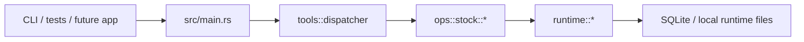

# StockMind

StockMind is the standalone stock-domain snapshot extracted from `TradingAgents`.

This repo keeps the current securities research / governance / execution / post-trade / training chain buildable as an independent Rust project, while intentionally leaving the old foundation, GUI, and license product shell behind.

## Current shape



## What is included

- Stock application boundary under `src/ops/stock.rs`
- Stock dispatcher and stock-only tool catalog
- Governed security runtime stores and SQLite repositories
- Stock/security integration tests and runtime fixtures

## What is intentionally excluded

- Foundation knowledge / workbook / metadata toolchain
- GUI shell
- Original license gate

## Compatibility note

The Cargo package name is now `stockmind`, but the library crate name remains `excel_skill` for test and code compatibility during this snapshot phase.

## Quick start

```bash
cargo check
cargo test --test security_decision_verify_package_cli -- --nocapture
```

## Runtime paths

StockMind prefers:

- `STOCKMIND_RUNTIME_DIR`
- `STOCKMIND_RUNTIME_DB`

It still accepts the inherited `EXCEL_SKILL_*` runtime env names so the migrated tests and fixtures keep working.
