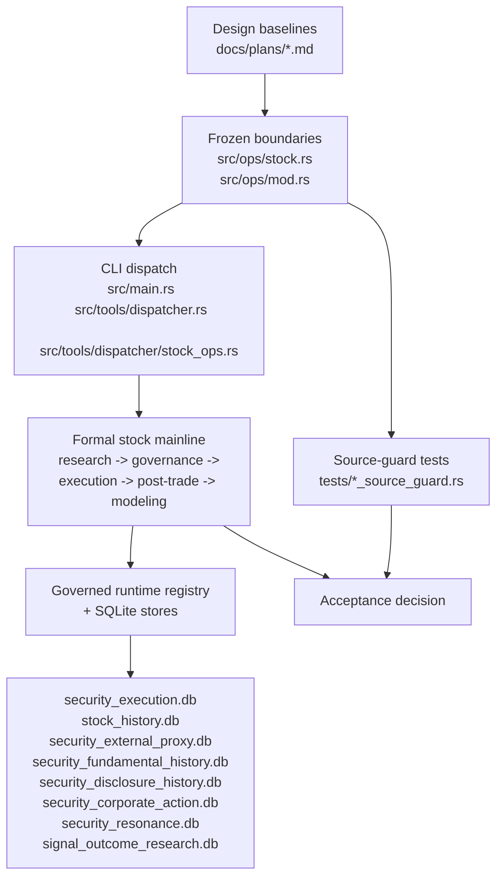

# StockMind Acceptance Checklist

## Purpose

This document is the explicit acceptance bridge between the approved design baselines and the current delivered repository state.

It is meant to answer two questions without guesswork:

1. Which design constraints are supposed to be true right now?
2. Which code, tests, and runtime checks prove they are still true?

## Delivery shape



## Design-to-delivery mapping

| Design baseline | Delivery surface | Guard / proof |
| --- | --- | --- |
| `2026-04-15-stock-application-entry-layer-design.md` | `src/ops/stock.rs`, `src/ops/stock_*_entry.rs` | `tests/stock_entry_layer_source_guard.rs` |
| `2026-04-16-stock-formal-boundary-manifest-gate-design.md` | `src/ops/stock.rs`, `src/ops/mod.rs` | `tests/stock_formal_boundary_manifest_source_guard.rs` |
| `2026-04-15-stock-foundation-boundary-gate-v2-design.md` | grouped shells, shared/runtime hold zone | `tests/stock_foundation_boundary_gate_v2_source_guard.rs` |
| `2026-04-15-stock-business-flow-baseline.md` | `src/tools/catalog.rs` grouped order | `tests/stock_catalog_grouping_source_guard.rs` |
| `2026-04-16-stock-modeling-lifecycle-split-design.md` | `src/ops/stock_modeling_and_training.rs`, `stock_online_scoring_and_aggregation.rs`, `stock_model_lifecycle.rs` | `tests/stock_modeling_training_split_source_guard.rs` |
| `2026-04-16-security-legacy-committee-governance-design.md` | legacy freeze + formal governance mainline | `tests/security_legacy_committee_application_surface_guard.rs`, `tests/security_legacy_committee_dependency_gate.rs`, `tests/security_legacy_committee_public_catalog_guard.rs` |
| `2026-04-20-p12-governed-portfolio-allocation-decision-design.md`, `2026-04-20-p12-enhanced-allocation-refinement-design.md` | formal `P10 -> P11 -> P12` portfolio-core chain | `tests/security_portfolio_core_chain_source_guard.rs` |
| `2026-04-20-post-p12-portfolio-execution-preview-design.md`, `2026-04-20-post-p12-execution-request-preview-standardization-design.md` | side-effect-free post-`P12` execution preview bridge with nested request-aligned preview rows | `tests/security_portfolio_execution_preview_cli.rs` |
| `2026-04-20-p13-portfolio-execution-request-bridge-design.md` | formal side-effect-free request bridge downstream of the standardized preview document | `tests/security_portfolio_execution_request_package_cli.rs` |
| `docs/AI_HANDOFF.md` | current split-repo boundary rules | all source-guard tests above reference this handoff baseline |

## Acceptance levels

### Level 1: structure acceptance

Pass when the frozen architecture boundaries still hold.

Run:

```bash
cargo test --test stock_entry_layer_source_guard -- --nocapture
cargo test --test stock_formal_boundary_manifest_source_guard -- --nocapture
cargo test --test stock_foundation_boundary_gate_v2_source_guard -- --nocapture
cargo test --test stock_modeling_training_split_source_guard -- --nocapture
cargo test --test stock_catalog_grouping_source_guard -- --nocapture
```

What this proves:

- `crate::ops` still exposes only the stock boundary
- scenario-entry modules still sit above grouped gateways
- grouped shells still do not reach directly into runtime or old foundation-style zones
- modeling online scoring and lifecycle ownership are still separated
- tool discovery still follows the approved business flow

### Level 2: formal mainline acceptance

Pass when the key stock chain still runs through the formal path instead of hidden compatibility shortcuts.

Run:

```bash
cargo test --test security_decision_submit_approval_cli -- --nocapture
cargo test --test security_decision_verify_package_cli -- --nocapture
cargo test --test security_decision_package_revision_cli -- --nocapture
cargo test --test security_lifecycle_validation_cli -- --nocapture
cargo test --test security_post_meeting_conclusion_cli -- --nocapture
cargo test --test security_post_trade_review_cli -- --nocapture
cargo test --test security_portfolio_core_chain_source_guard -- --nocapture
cargo test --test security_portfolio_execution_preview_cli -- --nocapture
cargo test --test security_portfolio_execution_request_package_cli -- --nocapture
```

What this proves:

- approval package artifacts are created and verified on the formal chain
- package revision still binds to the governed stock lifecycle
- execution record and post-trade review still round-trip through the lifecycle slice
- post-meeting conclusion still lands as a formal artifact and can revise package state
- the formal portfolio-core chain stays locked to `P10 -> P11 -> P12` document consumption and public-tool order
- the post-`P12` execution preview bridge stays preview-only and consumes only the governed allocation decision document
- the `P13` request bridge stays side-effect free and consumes only the standardized preview document

### Level 3: repository acceptance

Pass when the standalone repo still builds and the full stock test surface is green.

Run:

```bash
cargo check
cargo test -- --nocapture
```

Current reference baseline from local verification in this repo:

- full `cargo test -- --nocapture` completed successfully
- observed runtime was about 4 minutes 48 seconds on the current local machine

Use `docs/handoff/CURRENT_STATUS.md` for the latest branch-health truth.
This checklist remains the acceptance target map, not an automatically current status snapshot.

## Runtime ownership acceptance

The current delivered repo is accepted only if runtime DB ownership remains stock-only and governed through `src/runtime/formal_security_runtime_registry.rs`.

Expected runtime family:

- `security_execution.db`
- `stock_history.db`
- `security_external_proxy.db`
- `security_fundamental_history.db`
- `security_disclosure_history.db`
- `security_corporate_action.db`
- `security_resonance.db`
- `signal_outcome_research.db`

Expected runtime root resolution order:

1. `STOCKMIND_RUNTIME_DIR`
2. parent of `STOCKMIND_RUNTIME_DB`
3. `EXCEL_SKILL_RUNTIME_DIR`
4. parent of `EXCEL_SKILL_RUNTIME_DB`
5. `.stockmind_runtime/`

## What counts as accepted

This repo can be considered accepted for the current refactor phase when all of the following are true:

- structure acceptance passes
- formal mainline acceptance passes
- full repository acceptance passes
- no new module is added to `src/ops/stock.rs` without a design and guard update
- no old foundation dependency re-enters grouped shells, entry shells, dispatcher, or runtime ownership

## What this acceptance does not claim

This checklist does not claim that all future stock architecture work is complete.

It only claims that the currently approved split-repo design baselines are represented in code and defended by tests.

## Current intentional exclusions

- the old foundation stack
- the original GUI shell
- the original license gate
- balance-scorecard rework that was intentionally kept out of this round
