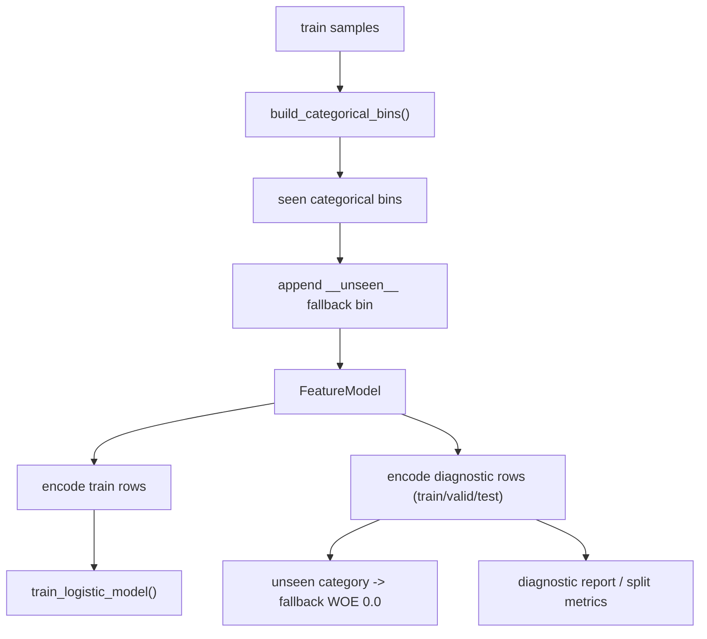

# 2026-04-17 Categorical Unseen Fallback Design

## Scope

This round fixes one specific stock-training runtime break:

- `security_scorecard_training` could train on categorical values seen in the `train` split
- but the new diagnostic phase re-encodes `train + valid + test`
- if `valid` or `test` contains a categorical value not seen in `train`, the run aborts

The goal is not to redesign the trainer.
The goal is to make the current governed `WOE + logistic` chain survive real unseen categorical values.

## Benchmarks

- Google `Rules of ML`
  - Source type: official ML guidance
  - Pattern adopted: keep feature contracts robust before changing model family
- AWS Prescriptive Guidance for MLOps
  - Source type: official operations guidance
  - Pattern adopted: prefer resilient data validation / fallback behavior over brittle pipeline failure

What is intentionally not copied:

- no online feature store
- no external ML serving layer
- no large-scale categorical target encoder redesign
- no chairman / committee gate change

## Problem Statement

The current trainer builds categorical bins from `train` only.

That is acceptable for fitting, but the new diagnostic layer now encodes all splits.
When a categorical value appears only in `valid` or `test`, the trainer fails with:

- `no categorical bin matched feature ...`

This is a contract bug, not a model-family problem.

## Design Choice

Recommended approach:

- keep categorical bins derived from `train`
- append one governed fallback categorical bin per categorical feature
- use that fallback only when no exact category match exists
- keep fallback WOE neutral (`0.0`) to avoid inventing unsupported directional bias

Why this approach:

- smallest collision with the ongoing refactor
- preserves current fitting behavior for seen values
- makes diagnostic / evaluation / real rerun stable
- avoids silently dropping features or skipping samples

## Method

1. Build categorical bins from `train` exactly as before.
2. Append one extra bin:
   - `bin_label = "__unseen__"`
   - `match_values = []`
   - `woe = 0.0`
   - counts = `0`
3. During categorical encoding:
   - first try exact category match
   - if none exists, use the unseen fallback bin
4. Preserve numeric feature behavior unchanged.

## Data Flow

## Dependencies

- existing `security_scorecard_training` split builder
- existing `FeatureModel / FeatureBinModel`
- existing diagnostic encoding path
- no new external dependency
- no Python dependency

## Database Calls

This round adds no new database and no new schema.

It reuses the same runtime reads already used by training:

- stock history reads
- feature snapshot / evidence bundle reads
- disclosure and corporate-action runtime stores

## Runtime Outputs

No new output file is introduced.

Expected visible change:

- categorical artifact bins will include one extra governed fallback bin for categorical features
- real reruns should no longer abort when `valid/test` introduces unseen categorical values

## Risks

1. Neutral fallback may slightly dilute the signal of rare categories.
   - Mitigation: limit fallback use to unseen values only; seen values keep exact bins.

2. Diagnostics may now show a fallback bin with zero support.
   - Mitigation: that is intentional and makes the contract explicit.

3. Some features may still overfit even after this fix.
   - Mitigation: this round fixes runtime stability only, not sample-factory quality.

## Tests

- add one regression test where:
  - `train` sees only `has_risk_warning_notice = false`
  - `test` sees `has_risk_warning_notice = true`
  - full training run still returns `ok`
- assert the artifact carries the fallback categorical bin
- rerun the real 40-stock request after the unit/integration regression passes
